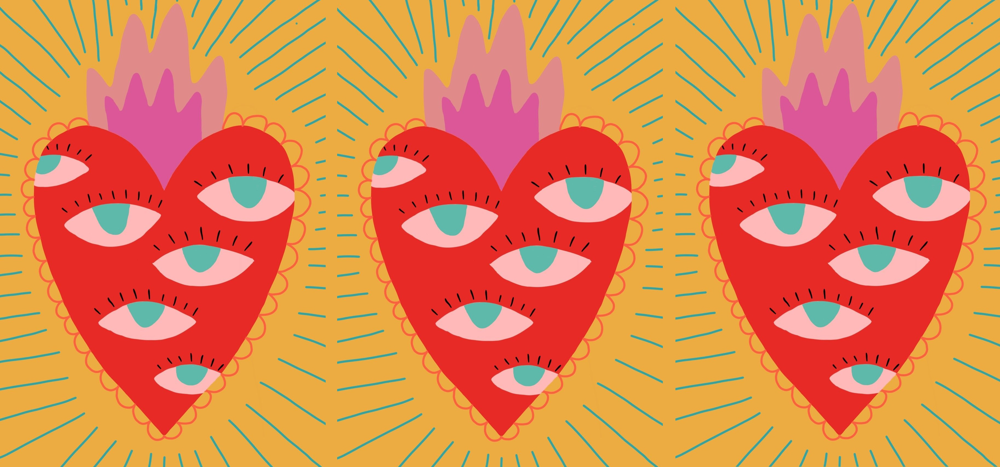

<!DOCTYPE html>
<html lang="it">
<head>
    <meta charset="UTF-8">
    <meta name="viewport" content="width=device-width, initial-scale=1.0">
    <title>TERE – Transfeminist Education on Relationships and Emotions</title>
<link href="https://cdn.jsdelivr.net/npm/bootstrap@5.3.0/dist/css/bootstrap.min.css" rel="stylesheet">
  <link rel="stylesheet" href="TERE_css_style/Tere_css">
    
    <!-- Metadati Dublin Core -->
    <meta name="DC.title" content="TERE – Transfeminist Education on Relationships and Emotions">
    <meta name="DC.creator" content="Tuo Nome">
    <meta name="DC.language" content="it">
    <meta name="DC.subject" content="Educazione sessuale, transfemminismo, emozioni, relazioni, diritti di genere">
    <meta name="DC.description" content="Un archivio digitale di risorse, progetti e iniziative sull’educazione sessuo-affettiva in chiave transfemminista in Europa.">

    <!-- Link al CSS -->
    <link rel="stylesheet" href="css/style.css">
</head>
<body>

    <!-- Navbar -->
    <nav class="navbar">
        <ul>
            <li><a href="index.html">Home</a></li>
            <li><a href="associazioni.html">Associazioni e Progetti</a></li>
            <li><a href="materiali.html">Materiali e Risorse</a></li>
            <li><a href="eventi.html">Eventi e Iniziative</a></li>
            <li><a href="mappa.html">Mappa</a></li>
            <li><a href="contribuisci.html">Contribuisci</a></li>
        </ul>
    </nav>

    <!-- Hero Image -->
    <header class="hero">
        
        

            <h1>TERE</h1>
            
Transfeminist Education on Relationships and Emotions

        

    </header>

    <!-- Sezioni introduttive -->
    <main class="intro">
        <section>
            <h2>Benvenut* su TERE</h2>
            
Questo sito raccoglie risorse, progetti e iniziative per un'educazione sessuo-affettiva transfemminista, inclusiva e intersezionale. È rivolto a chi educa, a chi lotta, a chi apprende.

        </section>

        <section>
            <h2>Esplora</h2>
            
Scopri collettivi, reti europee, materiali didattici e strumenti per trasformare l'educazione alla sessualità e alle relazioni.

            <ul>
                <li><a href="associazioni.html">Associazioni e progetti</a></li>
                <li><a href="materiali.html">Materiali e risorse</a></li>
                <li><a href="eventi.html">Eventi e iniziative</a></li>
                <li><a href="mappa.html">Mappa collaborativa</a></li>
                <li><a href="contribuisci.html">Segnala un contenuto</a></li>
            </ul>
        </section>
    </main>

    <footer>
        
© 2025 TERE – Progetto universitario. Tutti i diritti riservati. Powered by transfeminist values.

    </footer>

</body>
</html>
